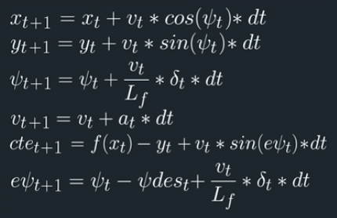

# CarND-Controls-MPC
Self-Driving Car Engineer Nanodegree Program

---

This project implements a **Model Predictive Control (MPC)** algorithm in C++ using **Ipopt** optimizer and **CppAD** automatic differentiation libraries to control steering and acceleration (throttle and brake) of a simulated vehicle driving around a track following reference waypoints.

This task was implemented to partially fulfill Term 2 goals of Udacity's Self-Driving Car Nanodegree Program.

# [Rubric points](https://review.udacity.com/#!/rubrics/896/view) 

## Compilation 

### Your code should compile.

The code compiles without errors or warnings. No modifications were done on the provided setup (CMakeLists.txt).

## Implementation

### The Model

The model used is a kinematic bicycle model neglecting the complex interactions between the tires and the road. The model equations are as follow:



Where:

- `x, y` : Car's position.
- `psi` : Car's heading direction.
- `v` : Car's velocity.
- `cte` : Cross-track error.
- `epsi` : Orientation error.

Those values are considered the state of the model. In addition to that, `Lf` is the distance between the car center of mass and the front wheels (this is provided by Udacity). The other two values are the model output:

- `a` : Car's acceleration (throttle/brake).
- `delta` : Steering angle.

These 2 values will be determined thanks to the MPC (see below).

### Timestep Length and Elapsed Duration (N & dt)

The number of points (`N`) and the time interval (`dt`) determine the prediction horizon (`=N*dt`). The number of points impacts the controller performance as well. With too many points the controller starts to run slower, as there are more calculations to do; with not enough, the system doesn't have a good idea of "what is coming next". After trying with `N` from 5 to 20 and `dt` 50 to 500 milliseconds, I finally decided to leave them fixed to 10 and 100 milliseconds, as they were set in the Project Q&A video, as it was giving good results.

### Polynomial Fitting and MPC Preprocessing

In order to simplify the calculations, the global coordinates waypoints provided by the simulator are transformered into the vehicle's local coordinates. First, each of the waypoints are adjusted by subtracting out px and py accordingly such that they are based on the vehicle's position. 

```c++
double shift_x = ptsx[i] - px;
double shift_y = ptsy[i] - py;
```

Next, the waypoint coordinates are adjusted using rotation equations to be in vehicle heading.

```c++
ptsx[i] = shift_x * cos(-psi) - shift_y * sin(-psi);
ptsy[i] = shift_x * sin(-psi) + shift_y * cos(-psi);
```

Then a third-degree polynomial is fitted to the transformed waypoints, using the `polyfit()` function. These polynomial coefficients are used to calculate the `cte` and `epsi` later on, and they are used by the solver as well as a reference trajectory.

Note that the initial position and heading direction of the car are always zero in this local car coordinates, thus the state of the car is initially

```c++
state << 0, 0, 0, v, cte, epsi;
```

### MPC

The objective is to find the acceleration (`a`) and the steering angle (`delta`) in the way it will minimize an objective function that is the combination of different factored weights:

- Square sum of cross track error `cte`, to ensure the car stays in the middle of the lane
- Square sum of orientation error `epsi`, to ensure the car heads in the desired direction
- Square sum of the deviation to the reference velocity, to ensure the car tries to run at desired speed
- Square sum of steering actuator, to minimize the use of the steering actuator (zero state corresponding to going straight)
- Square sum of acceleration actuator, to minimize the use of the throttle actuator (zero state corresponding to no acceleration)
- Square sum of the difference of sequential acceleration actuations, to penalize large actuation differences between two time steps, in order to minimize oscillations in the acceleration (don't accelerate and then brake)
- Square sum of the difference of sequential steering actuations, to penalize large actuation differences between two time steps, in order to have smooth turns (don't turn left and then right)

How much weight each of these factors has were tuned manually to obtain a successful track ride without leaving the road.

### Model Predictive Control with Latency

To handle actuator latency (between the actuators calculation and when the simulator will effectively perform these actuations), I added a step to predict where the vehicle would be after this latency, in order to calculate what action should be taken at that time instead of "now". The state values are calculated using the same update equations as those used for the MPC model (see equations in the **The Model** point) and the latency interval (100ms) as `dt`. These values are then used  as the initial ones instead of the ones provided by the simulator. 

I coded my system so that it is easy to change the latency value (or just put it to 0 so that to not add any latency).

The code implementing that can be found at [./src/main.cpp](https://github.com/darienmt/CarND-MPC-Project-P5/blob/master/src/main.cpp#L121) from line 101 to 103, and 131 to 133.

## Simulation

### The vehicle must successfully drive a lap around the track.

The vehicle successfully drives a lap around the track. Here is a short video with the final parameters: https://youtu.be/MJet2yevY3E

---

## Dependencies

* cmake >= 3.5
 * All OSes: [click here for installation instructions](https://cmake.org/install/)
* make >= 4.1(mac, linux), 3.81(Windows)
  * Linux: make is installed by default on most Linux distros
  * Mac: [install Xcode command line tools to get make](https://developer.apple.com/xcode/features/)
  * Windows: [Click here for installation instructions](http://gnuwin32.sourceforge.net/packages/make.htm)
* gcc/g++ >= 5.4
  * Linux: gcc / g++ is installed by default on most Linux distros
  * Mac: same deal as make - [install Xcode command line tools]((https://developer.apple.com/xcode/features/)
  * Windows: recommend using [MinGW](http://www.mingw.org/)
* [uWebSockets](https://github.com/uWebSockets/uWebSockets)
  * Run either `install-mac.sh` or `install-ubuntu.sh`.
  * If you install from source, checkout to commit `e94b6e1`, i.e.
    ```
    git clone https://github.com/uWebSockets/uWebSockets
    cd uWebSockets
    git checkout e94b6e1
    ```
    Some function signatures have changed in v0.14.x. See [this PR](https://github.com/udacity/CarND-MPC-Project/pull/3) for more details.

* **Ipopt and CppAD:** Please refer to [this document](https://github.com/udacity/CarND-MPC-Project/blob/master/install_Ipopt_CppAD.md) for installation instructions.
* [Eigen](http://eigen.tuxfamily.org/index.php?title=Main_Page). This is already part of the repo so you shouldn't have to worry about it.
* Simulator. You can download these from the [releases tab](https://github.com/udacity/self-driving-car-sim/releases).
* Not a dependency but read the [DATA.md](./DATA.md) for a description of the data sent back from the simulator.


## Basic Build Instructions

1. Clone this repo.
2. Make a build directory: `mkdir build && cd build`
3. Compile: `cmake .. && make`
4. Run it: `./mpc`.

## Tips

1. It's recommended to test the MPC on basic examples to see if your implementation behaves as desired. One possible example
is the vehicle starting offset of a straight line (reference). If the MPC implementation is correct, after some number of timesteps
(not too many) it should find and track the reference line.
2. The `lake_track_waypoints.csv` file has the waypoints of the lake track. You could use this to fit polynomials and points and see of how well your model tracks curve. NOTE: This file might be not completely in sync with the simulator so your solution should NOT depend on it.
3. For visualization this C++ [matplotlib wrapper](https://github.com/lava/matplotlib-cpp) could be helpful.)
4.  Tips for setting up your environment are available [here](https://classroom.udacity.com/nanodegrees/nd013/parts/40f38239-66b6-46ec-ae68-03afd8a601c8/modules/0949fca6-b379-42af-a919-ee50aa304e6a/lessons/f758c44c-5e40-4e01-93b5-1a82aa4e044f/concepts/23d376c7-0195-4276-bdf0-e02f1f3c665d)
5. **VM Latency:** Some students have reported differences in behavior using VM's ostensibly a result of latency.  Please let us know if issues arise as a result of a VM environment.

## Editor Settings

We've purposefully kept editor configuration files out of this repo in order to
keep it as simple and environment agnostic as possible. However, we recommend
using the following settings:

* indent using spaces
* set tab width to 2 spaces (keeps the matrices in source code aligned)

## Code Style

Please (do your best to) stick to [Google's C++ style guide](https://google.github.io/styleguide/cppguide.html).

## Project Instructions and Rubric

Note: regardless of the changes you make, your project must be buildable using
cmake and make!

More information is only accessible by people who are already enrolled in Term 2
of CarND. If you are enrolled, see [the project page](https://classroom.udacity.com/nanodegrees/nd013/parts/40f38239-66b6-46ec-ae68-03afd8a601c8/modules/f1820894-8322-4bb3-81aa-b26b3c6dcbaf/lessons/b1ff3be0-c904-438e-aad3-2b5379f0e0c3/concepts/1a2255a0-e23c-44cf-8d41-39b8a3c8264a)
for instructions and the project rubric.

## Hints!

* You don't have to follow this directory structure, but if you do, your work
  will span all of the .cpp files here. Keep an eye out for TODOs.

## Call for IDE Profiles Pull Requests

Help your fellow students!

We decided to create Makefiles with cmake to keep this project as platform
agnostic as possible. Similarly, we omitted IDE profiles in order to we ensure
that students don't feel pressured to use one IDE or another.

However! I'd love to help people get up and running with their IDEs of choice.
If you've created a profile for an IDE that you think other students would
appreciate, we'd love to have you add the requisite profile files and
instructions to ide_profiles/. For example if you wanted to add a VS Code
profile, you'd add:

* /ide_profiles/vscode/.vscode
* /ide_profiles/vscode/README.md

The README should explain what the profile does, how to take advantage of it,
and how to install it.

Frankly, I've never been involved in a project with multiple IDE profiles
before. I believe the best way to handle this would be to keep them out of the
repo root to avoid clutter. My expectation is that most profiles will include
instructions to copy files to a new location to get picked up by the IDE, but
that's just a guess.

One last note here: regardless of the IDE used, every submitted project must
still be compilable with cmake and make./

## How to write a README
A well written README file can enhance your project and portfolio.  Develop your abilities to create professional README files by completing [this free course](https://www.udacity.com/course/writing-readmes--ud777).
